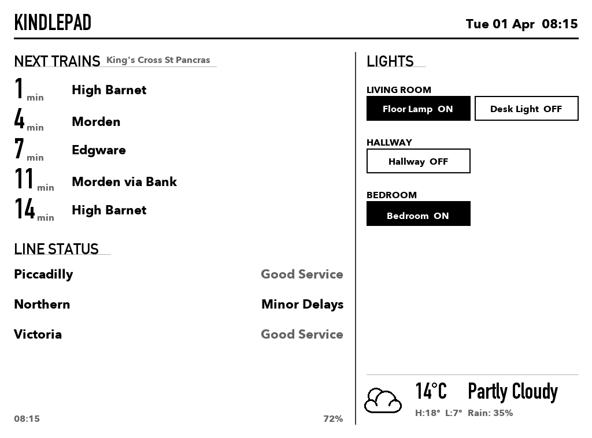

# KindlePad

I've got a Kindle Paperwhite 3 from 2014, turned into a wall-mounted smart home panel. The server runs on a Samsung Galaxy Note 9 from 2018, otherwise mostly a dust collector. I welcomed them to their second life.

*What's displayed on the Kindle*

Built over a weekend with [Claude Code](https://claude.ai/code).

## What it does

My Kindle now shows me train departures and line status from TfL, lets me tap to toggle IKEA lights (via a Dirigera hub), and gives me weather at a glance. Handy prep device when heading out.

The whole thing runs locally, so no cloud (except cumulonimbus), also no accounts (anon everywhere), and no subscriptions (just daemons on the run).

## How it works

A Python server renders a grayscale image, sends it to the Kindle over HTTP. The Kindle refreshes every couple of minutes and after each tap. Taps get sent back to the server, which figures out what was pressed and does the thing (toggle a light, mostly).

The Kindle is ~~jailbroken~~ free-ranged, with FBInk for the display and a shell script running the fetch/display/touch loop. The Note 9 runs Termux with Python and uvicorn.

## The pieces

| | |
|---|---|
| Kindle PW3 | Display and touch input |
| Galaxy Note 9 | Runs the server in Termux |
| IKEA Dirigera | Controls the lights locally |
| TfL API | Train times and service status |
| Open-Meteo | Weather, but it's always raining |
| Pillow | Draws the dashboard server-side |
| FBInk | Pushes images to the Kindle screen |

## But why?

Well, I got a Dirigera hub and wanted to control house lights without pulling out my phone every time. The Kindle and the Note 9 were both just sitting around. Seemed like a waste to let them rot away. The train times and weather ended up being the most useful bit — quick check on the way out the door.

I look forward to doing another project with my current newer daily drivers.

## License

MIT — it worked for me, maybe it will for you and your devices.
